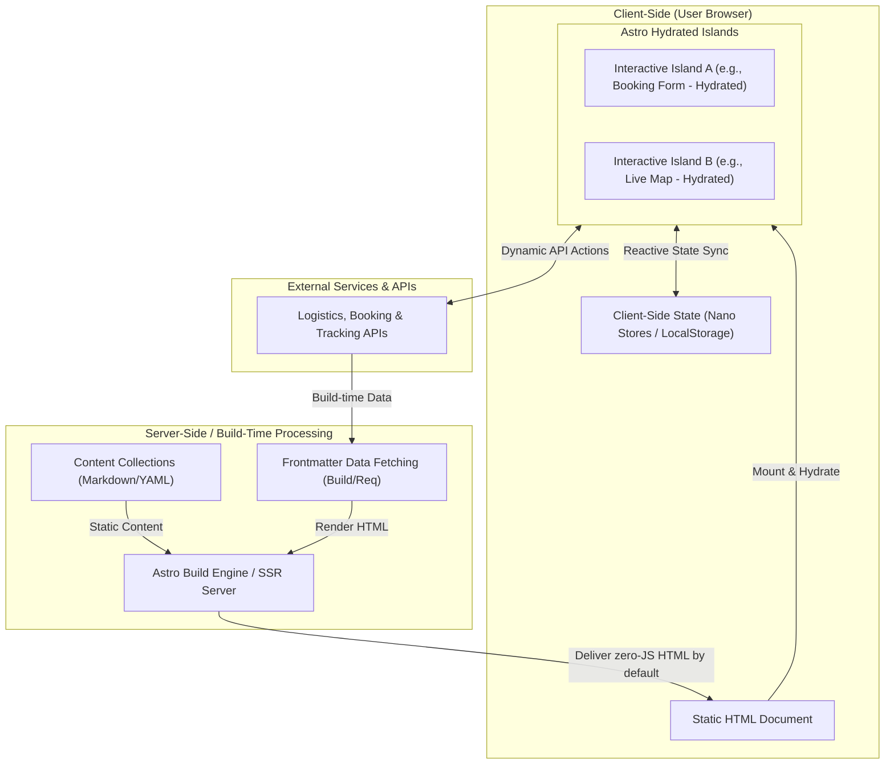

# Architecture Design Contract

This document provides a high-level architectural overview of the **National Logistics** platform. As a fresh, greenfield Astro-based application, it is designed from the ground up to leverage the modern performance benefits of the **Islands Architecture** and a highly modular **Multi-Page Application (MPA)** model.

---

## 1. High-Level Architectural Pattern

The National Logistics platform is designed to prioritize fast initial page load times, excellent search engine optimization (SEO), and highly responsive interactivity. To achieve this, it adheres to the following architectural patterns:



### Key Architectural Pillars

1. **Static-First Mentality:** All page templates, layouts, and informational content are compiled into optimized static HTML files.
2. **Component-Based Modularization:** Interface components are decoupled and built as isolated functional blocks.
3. **Framework Agnosticism:** The architecture supports bringing any frontend framework (React, Vue, Svelte, or vanilla JS/TS) inside the islands without imposing global framework overhead on static parts of the site.

---

## 2. Rendering Strategy

The platform utilizes Astro’s modern rendering ecosystem, offering flexibility as the logistics features evolve from static marketing pages to dynamic tracking dashboards:

### Multi-Page Application (MPA) Routing
Unlike standard Single-Page Applications (SPAs) which require long initial loads to download massive JavaScript bundles, the National Logistics platform loads pages individually. This ensures:
- **Instant TTI (Time to Interactive):** Unused page bundles are never loaded.
- **Robustness:** A script failure on one page does not break the entire web application context.

### Current Stage: Static Site Generation (SSG)
During the greenfield phase, the project is configured for **Static Site Generation (SSG)**. Page layouts and basic content are pre-rendered at build time:
- High security (no database access on requests).
- Low latency (distribution via global Edge CDNs).

### Future Stage: Hybrid / Server-Side Rendering (SSR)
As operations-oriented features are added (such as real-time tracking, authenticated dashboards, and dispatch logs), the platform will transition to **Hybrid/SSR mode** using an adapter (e.g., `@astrojs/node` or `@astrojs/vercel`).
- **Static Pages:** Home, Contact, Services, FAQs, and static documents are pre-rendered.
- **Dynamic Pages:** Authed client portals, tracking queries, and real-time dispatch routes are rendered on the fly per request.

---

## 3. Rendering Boundaries & Astro Islands

The platform achieves a performant balance between static speeds and dynamic application behavior via **Astro Islands (Partial Hydration)**.

### How Islands Work
Most of the page is delivered as standard, zero-JavaScript HTML. Pages contain "islands" of dynamic behavior where interactive client-side components are inserted:

```html
<!-- Example of Islands inside an Astro Page -->
<Layout>
  <!-- Zero-JS static header -->
  <Header />

  <!-- Zero-JS static hero section -->
  <HeroSection />

  <!-- ISLAND: Hydrates instantly on page load -->
  <BookingCalculator client:load />

  <!-- Zero-JS static informational section -->
  <FeaturesList />

  <!-- ISLAND: Hydrates only when visible on screen -->
  <LiveShipmentTracker client:visible />

  <!-- Zero-JS footer -->
  <Footer />
</Layout>
```

### Hydration Directives Reference
Components are hydrated selectively based on performance priorities:
*   `client:load`: High-priority interactive components (e.g., mobile navigation toggles, login forms).
*   `client:idle`: Medium-priority interactive elements hydrated once the browser is idle (e.g., live chat widgets, secondary filters).
*   `client:visible`: Low-priority interactive elements hydrated only when entering the viewport (e.g., interactive charts, testimonial carousels, maps).
*   `client:only`: Skip server rendering entirely; renders solely on the client. Useful for components relying heavily on browser-only globals (e.g., `window`, `localStorage`).

---

## 4. Data Flow

Data flows efficiently along separate server-side and client-side pathways depending on the lifecycle phase:

```
[Build Time / Request Time Server Process]
  (APIs / Markdown Files) ──> [Frontmatter Block (---)] ──> [Astro Template Variables] ──> [Static HTML Generated]
                                                                                                │
[Runtime / Browser Hydration Process]                                                          ▼
  [Client-Side Hydrated Island] ──> [Dynamic Fetch Request] ──> [APIs] ──> [Local Component State Update]
```

### A. Build-Time Data Fetching (Static Flow)
Performed inside the Astro component frontmatter script block (`---`):
*   Executed **only on the server** during the build phase (or request time in SSR).
*   Can safely call private database engines, access environment secrets, and retrieve static files.
*   Data is passed down as standard properties (`props`) to children components. No client-side fetch is performed for this data.

### B. Client-Side Data Fetching (Dynamic Flow)
Executed within hydrated framework components (islands) once loaded in the browser:
*   Fires standard asynchronous fetch calls directly from the browser to public REST/GraphQL APIs.
*   Handles live search filtering, real-time shipment updates, and booking submissions.
*   State changes trigger component re-renders confined locally within the boundaries of that specific island.

---

## 5. Component Hierarchy Concept

To maintain a clean and scalable developer experience, the component architecture is organized hierarchically based on responsibility:

1.  **Page Components (`src/pages/`)**:
    *   Act as entry points for routing.
    *   Responsible for page-specific layouts, SEO titles, frontmatter metadata, and root-level static data fetching.
2.  **Layout Components (`src/layouts/`)**:
    *   Act as page wrappers to establish the boilerplate HTML structure (`<html>`, `<head>`, `<body>`).
    *   Manage global headers, footers, stylesheets, and fonts.
3.  **UI Component Layer (`src/components/`)**:
    *   **Atom / Primitive Components:** Simple, reusable components without complex state (e.g., buttons, input tags, badges).
    *   **Molecular / Functional Components:** Interactive component packages which might act as Islands (e.g., search bars, accordions, modals).
    *   **Container / Compound Components:** Complex dashboards or forms orchestrating several primitive inputs and dealing with side effects (e.g., shipment creation forms).
