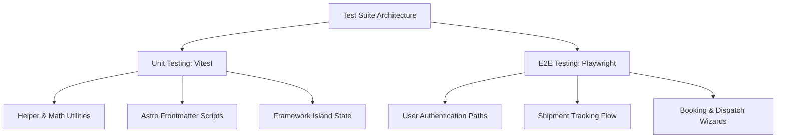

# Testing Strategy & Manual Verification

This document defines the testing strategy, automated tooling blueprint, and manual verification pipeline for the **National Logistics** platform. 

> [!NOTE]
> **Greenfield Phase Status:** This is a newly initialized Astro project. No testing frameworks, unit test suites, or end-to-end (E2E) environments are pre-configured yet. This document establishes the blueprint and requirements for establishing our test automation suites and our transition from strict manual verification to a CI/CD-driven automated test pipeline.

---

## 1. Automated Testing Architecture (Proposed Blueprint)

To ensure high reliability without excessive setup overhead, we propose a lightweight, standard-compliant test stack specifically optimized for Astro and TypeScript.



### 1.1 Unit Testing: Vitest
*   **Why Vitest:** Extremely fast, natively supports ESM, TypeScript, and JSX out of the box, and directly reuses the build configuration.
*   **Scope:** 
    *   Pure utilities (e.g., date formatters, distance calculators, routing algorithms, validation layers under `src/utils/` and `src/lib/`).
    *   State management functions and hooks.
    *   Framework islands (Preact/React) components isolated from Astro wrappers.

### 1.2 End-to-End (E2E) Testing: Playwright
*   **Why Playwright:** Provides reliable, multi-browser (Chromium, Firefox, WebKit) visual and functional testing, exceptional debugging toolsets, and highly resilient auto-waiting selectors.
*   **Scope:**
    *   Core business workflows (Tracking searches, secure authentication, shipment booking forms, map integration load states).
    *   Multi-device emulation (Desktop, iPad, iPhone screen ratios).
    *   External API error containment (e.g., verifying page behavior when map services are offline).

---

## 2. Recommended Test Implementation Framework

### 2.1 Proposed package.json Scripts
Once testing tools are installed, the following scripts should be integrated into `package.json`:

```json
"scripts": {
  "test": "vitest run",
  "test:watch": "vitest",
  "test:coverage": "vitest run --coverage",
  "test:e2e": "playwright test",
  "test:e2e:ui": "playwright test --ui"
}
```

### 2.2 Writing a Unit Test (Vitest Example)
Unit test files should reside directly next to the files they are testing, using the `.test.ts` extension.

```typescript
// src/utils/format-date.test.ts
import { describe, it, expect } from 'vitest';
import { formatShipmentDate } from './format-date';

describe('formatShipmentDate()', () => {
  it('should format valid ISO dates to standard logistics readable format', () => {
    const input = '2026-05-21T12:00:00Z';
    const result = formatShipmentDate(input);
    expect(result).toBe('May 21, 2026 - 12:00 UTC');
  });

  it('should return "Invalid Date" fallback gracefully when format fails', () => {
    expect(formatShipmentDate('')).toBe('N/A');
    expect(formatShipmentDate('bad-date-string')).toBe('N/A');
  });
});
```

---

## 3. Manual Verification Pipeline Checklist

Until automated frameworks are initialized and integrated into a CI pipeline, **every pull request and deployment must be verified manually** using this strict checklist.

### Step 1: Local Linting & TypeScript compilation
Run locally before any manual feature testing to verify static syntax correctness:
- [ ] TypeScript compiles cleanly: No warnings or errors when executing `tsc --noEmit` or equivalent compiler check.
- [ ] The application builds without errors: `npm run build` or `pnpm build` finishes with an exit code of `0`.

### Step 2: Cross-Browser Verification
Open the changes on a local development server (`npm run dev`) and test in at least two of the following browser engines:
- [ ] **Chromium-based:** Google Chrome or Microsoft Edge (Core functional verification).
- [ ] **WebKit-based:** Safari (macOS/iOS compatibility check).
- [ ] **Gecko-based:** Firefox (Layout alignment check).

### Step 3: Responsive Layout Verification
Use browser developer tools to verify responsiveness across the standard design sizes:
- [ ] **Mobile (375px - 480px width):**
    - [ ] Navigation folds cleanly into a hamburger/mobile navigation drawer.
    - [ ] Text does not overflow boundaries or overlap other elements.
    - [ ] Touch targets are clearly spaced (minimum 44px gap).
- [ ] **Tablet (768px - 1024px width):**
    - [ ] Grids adapt appropriately (e.g., three-column grids collapse to two-columns).
- [ ] **Desktop (1280px+ width):**
    - [ ] Maximum page container widths are respected to prevent stretched, illegible layouts on ultra-wide screens.

### Step 4: Core Functionality Check
Test the actual user interface flow:
- [ ] **Critical Paths:** Trigger every action in the feature path (e.g., click the tracking button, submit the form, toggle the side drawer).
- [ ] **Edge Cases / Input Boundaries:**
    - [ ] Enter excessively long text in input fields (check layout scaling).
    - [ ] Enter symbols or negative numbers in form fields (verify validation filters).
    - [ ] Submit empty forms (verify validation triggers and focus moves to first errored input).
- [ ] **Error Recoverability:** If an API request fails, verify that an appropriate error state is rendered instead of a blank white screen or a standard crash page.

### Step 5: Accessibility (a11y) & Performance Audit
- [ ] Run a standard **Lighthouse** audit on the page in Chrome Incognito mode. Ensure:
    - [ ] **Accessibility Score:** >= 90
    - [ ] **Performance Score:** >= 90
    - [ ] **Best Practices Score:** >= 90
- [ ] Perform a simple keyboard navigation check:
    - [ ] Pressing `Tab` cycles through inputs, links, and buttons in a natural visual flow.
    - [ ] Currently focused elements have a high-contrast outline border.
    - [ ] Pressing `Enter` or `Space` executes active keyboard elements.

---

## 4. Proposed Continuous Integration (CI) Pipeline

Once the testing infrastructure is established, we propose adding a GitHub Actions workflow (`.github/workflows/ci.yml`) to automatically enforce quality gates on every Pull Request to the `main` branch.

### Suggested CI Workflow Configuration
```yaml
name: Continuous Integration

on:
  push:
    branches: [ main ]
  pull_request:
    branches: [ main ]

jobs:
  quality-gate:
    runs-on: ubuntu-latest
    steps:
      - name: Checkout Code
        uses: actions/checkout@v4

      - name: Install Node.js
        uses: actions/setup-node@v4
        with:
          node-version: '22.12.0'
          cache: 'pnpm'

      - name: Install pnpm
        uses: pnpm/action-setup@v3
        with:
          version: 9

      - name: Install Dependencies
        run: pnpm install --frozen-lockfile

      - name: Run Linter
        run: pnpm run lint

      - name: Compile TypeScript
        run: pnpm exec tsc --noEmit

      - name: Build Application
        run: pnpm run build

      - name: Run Unit Tests
        run: pnpm run test
```
